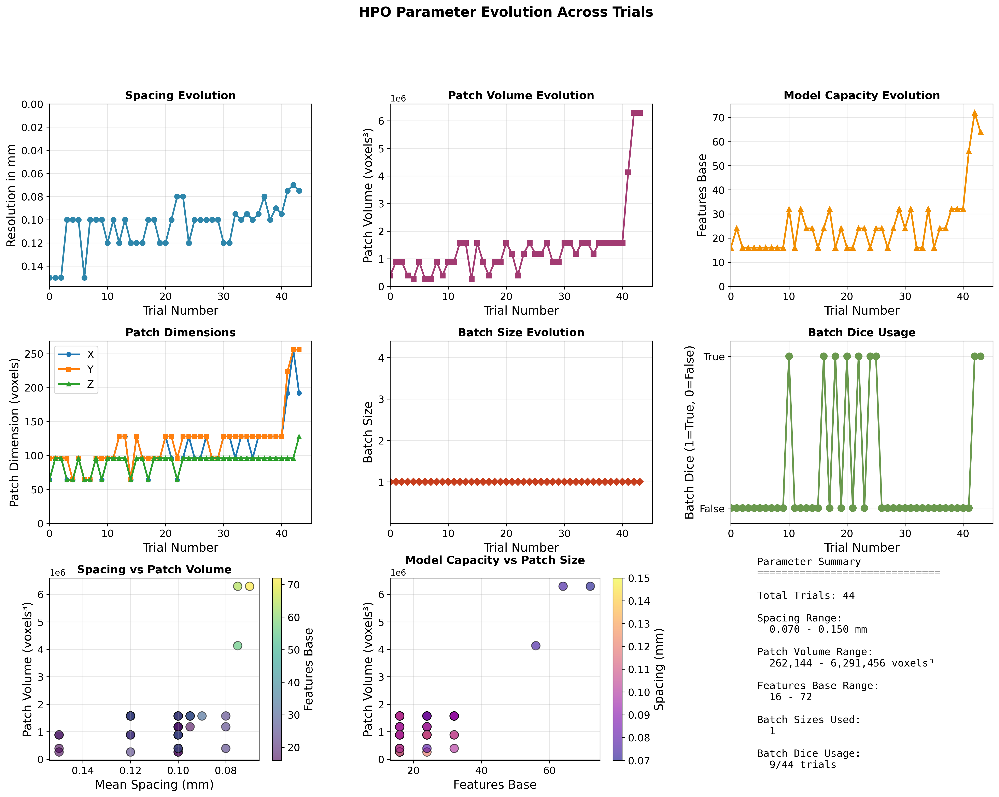
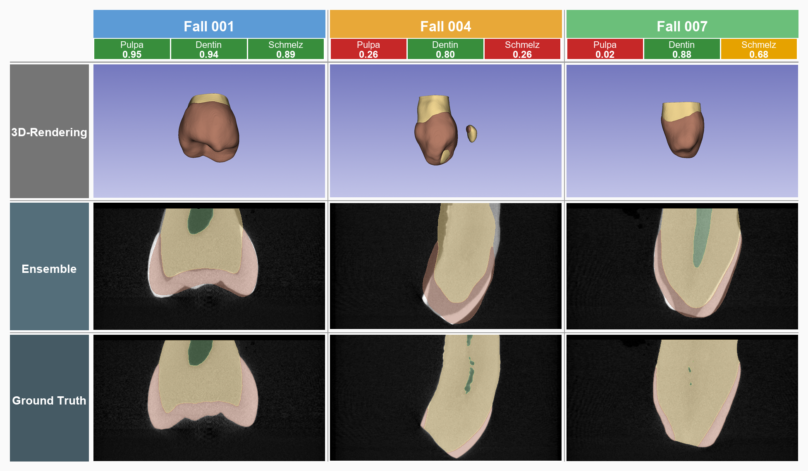
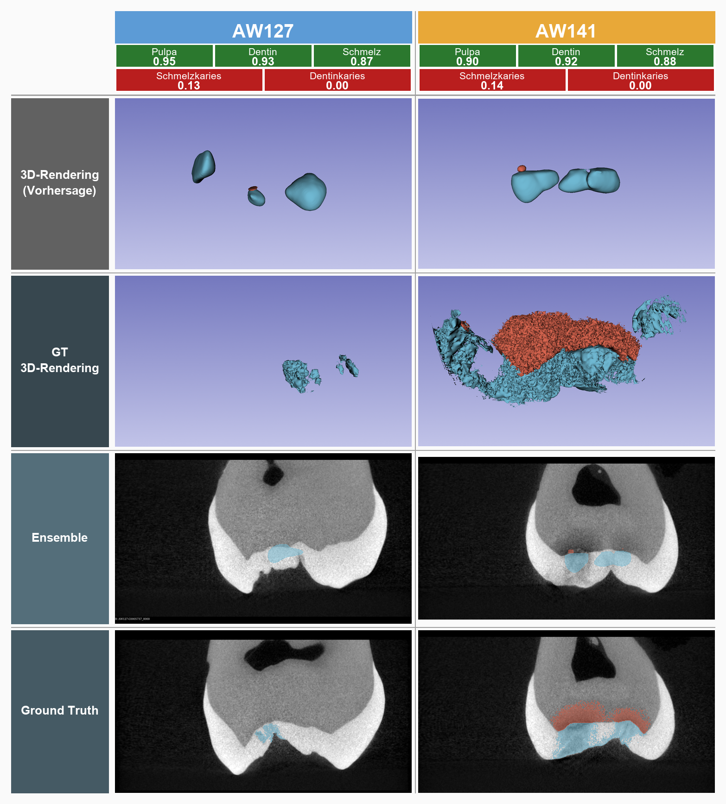
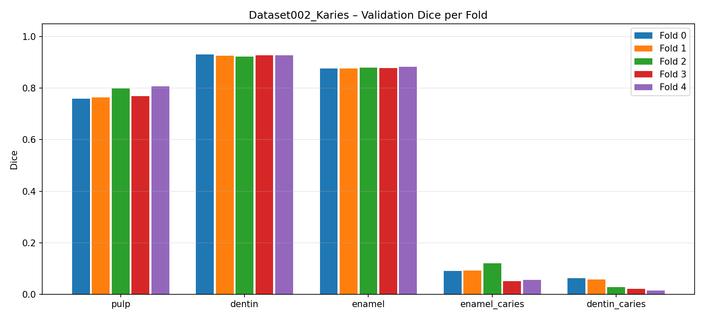

# 3D Tooth Segmentation using nnU-Net

Deep learning pipeline for 3D tooth segmentation on µCT scans using nnU-Net v2.  
Includes hyperparameter optimization (HPO) with Optuna, 5-fold cross-validation, ensemble inference, and analysis utilities.

---

## Contents

1. [Project Overview](#project-overview)
2. [Datasets](#datasets)
3. [Setup](#setup)
4. [Standard Pipeline](#standard-pipeline)
5. [HPO Pipeline](#hpo-pipeline)
6. [Analysis](#analysis)
7. [Results](#results)
8. [Project Structure](#project-structure)
9. [Notebooks](#notebooks)
10. [Contributors and Organisation](#contributors-and-organisation)
11. [License](#license)

---

## Project Overview

| Property       | Value                                      |
|----------------|--------------------------------------------|
| Task           | 3D semantic segmentation of tooth tissues  |
| Modality       | µCT (micro-computed tomography)            |
| Framework      | nnU-Net v2                                 |
| Architecture   | 3D Full-Resolution U-Net (auto-configured) |
| HPO            | Optuna (TPE sampler)                       |
| Datasets       | Dataset001_GroundTruth, Dataset002_Karies  |

---

## Datasets

### Dataset001_GroundTruth — 3-class segmentation

| Label | Class ID |
|-------|----------|
| Pulp  | 1        |
| Dentin | 2       |
| Enamel | 3       |

### Dataset002_Karies — 5-class segmentation (includes caries)

| Label           | Class ID |
|-----------------|----------|
| Pulp            | 1        |
| Dentin          | 2        |
| Enamel          | 3        |
| Enamel caries   | 4        |
| Dentin caries   | 5        |

Both datasets follow the nnU-Net raw data convention:

```
data/nnUNet_raw/<DatasetXXX_Name>/
├── imagesTr/       # Training images  (*_0000.nii.gz)
├── labelsTr/       # Training labels  (*.nii.gz)
├── imagesTs/       # Test images
├── labelsTs/       # Test labels
└── dataset.json    # Label map and metadata
```

The test sets were split from the training data differently per dataset:

- **Dataset001_GroundTruth:** manually split — the first 20 cases were moved to `imagesTs/labelsTs` as the held-out test set.
- **Dataset002_Karies:** randomly split using a fixed random seed for reproducibility:

```bash
python scripts/utils/split_dataset_test_set.py --dataset Dataset002_Karies --seed 42
```

---

## Setup

```bash
# 1. Clone and enter the repository
git clone <repo-url>
cd CT-Tooth-Segmentation-DeepLearning

# 2. Create the conda environment
conda env create -f environment.yml
conda activate ct-tooth-seg   # name as defined in environment.yml

# 3. Adjust environment paths (once, machine-specific)
#    Edit scripts/nnunet_env.sh and set:
#      nnUNet_raw, nnUNet_preprocessed, nnUNet_results, NNUNET_BIN_DIR

# 4. Load environment variables (once per shell session)
source scripts/nnunet_env.sh
```

> All commands below assume the project root as working directory and the conda environment active.

---

## Standard Pipeline

The standard pipeline trains nnU-Net with the auto-generated or HPO-optimized plan, runs 5-fold cross-validation, predicts on the test set, and ensembles the fold predictions.

### Step 0 — Planning (fingerprint + experiment plan)

```bash
bash scripts/00_plan.sh Dataset001_GroundTruth
```

Generates `nnUNetPlans.json` under `nnUNet_preprocessed`. Edit it manually if needed before preprocessing.

### Step 1 — Preprocessing

```bash
bash scripts/01_preprocess.sh Dataset001_GroundTruth 3d_fullres
```

If `hpo/best_model/nnUNetPlans.json` exists, it is automatically used instead of the auto-generated plan.

### Step 2 — Training (one fold)

```bash
bash scripts/02_training.sh Dataset001_GroundTruth 3d_fullres 0
```

Trains fold 0 and logs GPU usage to `logs/training_run/`. Repeat for folds 1–4.  
To resume, simply re-run the same command — nnU-Net continues from the last checkpoint.

### Step 3 — Prediction (all folds)

```bash
bash scripts/03_predict.sh Dataset001_GroundTruth 3d_fullres \
     data/nnUNet_raw/Dataset001_GroundTruth/imagesTs \
     predictions
```

Output: `predictions/Dataset001_GroundTruth/fold_0/`, `fold_1/`, …  
Predictions are saved with softmax probabilities (`--save_probabilities`) for ensembling.

### Step 4 — Ensemble

```bash
bash scripts/04_ensemble.sh Dataset001_GroundTruth 3d_fullres
```

Output: `ensemble_predictions/Dataset001_GroundTruth_3d_fullres/`

---

## HPO Pipeline

The HPO pipeline uses Optuna to search over spacing, patch size, feature capacity, and batch-dice settings. Each trial gets its own preprocessed data and archived training results.

**Full documentation:** [`hpo/README.md`](hpo/README.md)  
**Methodology background:** [`hpo/METHODOLOGY.md`](hpo/METHODOLOGY.md)  
**Preprocessing details:** [`hpo/PREPROCESSING_DETAILS.md`](hpo/PREPROCESSING_DETAILS.md)

### Quick reference

```bash
# Generate and preprocess HPO trials
python hpo/scripts/preprocessing/nnunet_hpo_preprocess.py --n_trials 5

# Train all trials (fold 0, no evaluation)
python hpo/scripts/training/nnunet_train_eval_pipeline.py --folds 0 --skip_evaluation

# Summarize trial parameters + scores
python hpo/scripts/analysis/summarize_trials.py
python hpo/scripts/analysis/plot_trials_summary.py
```

*HPO overview: evolution of key plan parameters across trials.*



---

## Analysis

All analysis scripts are under `scripts/analysis/` and write outputs to `analysis_results/`.  
Full documentation: [`scripts/analysis/README.md`](scripts/analysis/README.md)

### Dataset analysis

```bash
python scripts/analysis/dataset/analyze_dataset_metadata.py --dataset Dataset002_Karies
python scripts/analysis/dataset/analyze_grayscale_statistics.py --dataset Dataset002_Karies
python scripts/analysis/dataset/create_grayscale_histogram.py --dataset Dataset002_Karies
python scripts/analysis/dataset/create_label_histogram.py --dataset Dataset002_Karies
```

### Training analysis

```bash
python scripts/analysis/training/analyze_trial_parameters.py
python scripts/analysis/training/analyze_training_and_ensemble.py --dataset Dataset001_GroundTruth
```

### Evaluation

```bash
# Per-fold validation Dice/IoU
python scripts/analysis/evaluation/evaluate_folds.py --dataset Dataset001_GroundTruth

# Ensemble evaluation on test set
python scripts/analysis/evaluation/evaluate_ensemble.py \
    --dataset Dataset001_GroundTruth \
    --pred_dir ensemble_predictions/Dataset001_GroundTruth_3d_fullres \
    --labels_dir data/nnUNet_raw/Dataset001_GroundTruth/labelsTs
```

---

## Results

### Dataset001_GroundTruth — Cross-validation (mean over 5 folds)

| Label  | Dice  | IoU   |
|--------|-------|-------|
| Pulp   | 0.815 | 0.708 |
| Dentin | 0.938 | 0.884 |
| Enamel | 0.896 | 0.813 |

*Example results: IoU per case, 3D renderings and ensemble vs. ground truth (2D slices).*



### Dataset002_Karies — Cross-validation (mean over 5 folds)

| Label           | Dice  | IoU   |
|-----------------|-------|-------|
| Pulp            | 0.780 | 0.657 |
| Dentin          | 0.927 | 0.865 |
| Enamel          | 0.879 | 0.785 |
| Enamel caries   | 0.082 | 0.046 |
| Dentin caries   | 0.037 | 0.021 |

*Example results: IoU per case including caries labels, 3D/2D prediction vs. ground truth.*



*Stability across folds: per-label performance comparison (Dice/IoU) for Dataset002_Karies.*



**Best HPO result:** trial_43, fold 0, validation Dice ≈ 0.783 (foreground_mean).

**Metrics:** Dice (primary), IoU, Hausdorff Distance 95 (HD95), FP/FN voxel counts — as reported by `nnUNetv2_evaluate_folder`.

---

## Project Structure

```
CT-Tooth-Segmentation-DeepLearning/
│
├── hpo/                          # HPO pipeline
│   ├── scripts/
│   │   ├── preprocessing/        # nnunet_hpo_preprocess.py
│   │   ├── training/             # nnunet_train_eval_pipeline.py
│   │   ├── analysis/             # summarize_trials.py, plot_trials_summary.py
│   │   └── utils/                # check_trial_labels.py
│   ├── config/                   # nnUNetPlans_template.json + trial configs
│   ├── analysis/                 # trials_summary.json, plots/
│   ├── preprocessing_output/     # Trial preprocessed data  (not in repo)
│   ├── training_output/          # Archived training runs   (not in repo)
│   ├── results/                  # Evaluation logs          (not in repo)
│   ├── README.md                 # HPO runbook (commands)
│   ├── METHODOLOGY.md            # Scientific methodology description
│   └── PREPROCESSING_DETAILS.md  # Technical preprocessing details
│
├── scripts/                      # Main pipeline scripts
│   ├── 00_plan.sh                # Fingerprint + planning
│   ├── 01_preprocess.sh          # Preprocessing
│   ├── 02_training.sh            # Training (one fold) + GPU logging
│   ├── 03_predict.sh             # Prediction (all folds)
│   ├── 04_ensemble.sh            # Ensemble
│   ├── nnunet_env.sh             # Environment variables (machine-specific)
│   ├── nnunet_env.py             # Python wrapper for nnunet_env.sh
│   ├── analysis/
│   │   ├── dataset/              # analyze_dataset_metadata, analyze_grayscale_statistics,
│   │   │                         #   create_grayscale_histogram, create_label_histogram
│   │   ├── training/             # analyze_trial_parameters, analyze_training_and_ensemble
│   │   ├── evaluation/           # evaluate_folds, evaluate_ensemble
│   │   └── README.md
│   ├── utils/
│   │   ├── split_dataset_test_set.py    # Split test set (used for Dataset002_Karies, seed 42)
│   │   └── create_validation_subset.py  # Create smaller validation subset
│   └── README.md
│
├── notebooks/                    # Exploratory notebooks
│   ├── nnUNetv2_DataFormatting.ipynb   # Data format preparation
│   └── LabelCheck.ipynb               # Label verification
│
├── data/                         # nnUNet_raw / preprocessed / results  (not in repo)
├── logs/                         # Training + GPU logs                  (not in repo)
├── predictions/                  # Per-fold predictions                 (not in repo)
├── ensemble_predictions/         # Ensemble outputs                     (not in repo)
├── analysis_results/             # Generated analysis outputs           (partially in repo)
│
├── environment.yml               # Conda environment
├── .gitignore
└── README.md
```

---

## Notebooks

| Notebook | Purpose |
|----------|---------|
| `notebooks/nnUNetv2_DataFormatting.ipynb` | Preparing raw µCT data into nnU-Net format |
| `notebooks/LabelCheck.ipynb` | Verifying label integrity and class distribution |

---

## Configuration

Key environment variables configured in `scripts/nnunet_env.sh`:

| Variable             | Description                                  |
|----------------------|----------------------------------------------|
| `nnUNet_raw`         | Path to raw datasets (`DatasetXXX/`)         |
| `nnUNet_preprocessed`| Path to preprocessed data                   |
| `nnUNet_results`     | Path to training results and checkpoints     |

For HPO trials, `nnUNet_preprocessed` and `nnUNet_results` are overridden per trial to point to trial-specific directories under `hpo/preprocessing_output/` and `hpo/training_output/`.

---

## Contributors and Organisation

This project was developed as part of a Bachelor's thesis at the **Technische Hochschule Augsburg (THA)** in collaboration with the **Poliklinik für Zahnerhaltung und Parodontologie, LMU Klinikum München**.

| Role | Name | Institution |
|------|------|-------------|
| Author | Johannes Geiger | Technische Hochschule Augsburg (THA) |
| Supervisor | Dr. med. Elias Walter | LMU Klinikum München |
| Supervisor | Prof. Dr. Peter Rösch | Technische Hochschule Augsburg (THA) |

The µCT datasets used in this work were provided by the **Poliklinik für Zahnerhaltung und Parodontologie, LMU Klinikum München**.

---

## License

MIT License.
